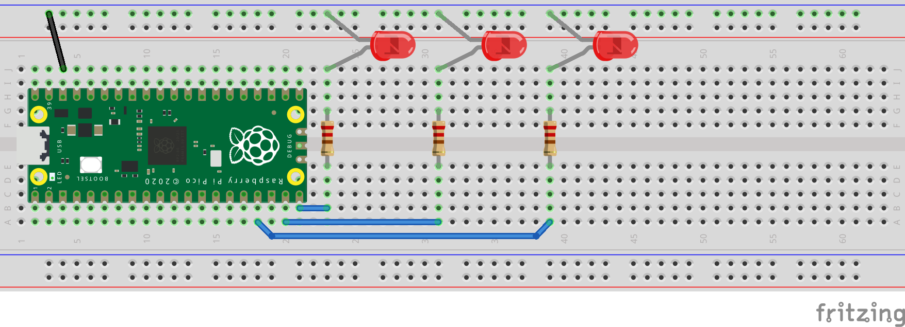

## Blink example
**Example using micropython on the Raspberry Pico. Building upon the Blink example, 3 LEDs are animated in sequence**  
We move on to import only the functions we need from modules instead of calling the entire module. 
This limits our amount of typing in the whole of the code. 
 
**Functions imported from modules:**
- Pin from machine
- sleep from utime

**ALWAYS ADD A RESISTOR FOR THE LEDS!** (220 or 330 ohm for example)

### Hookup guide here:

