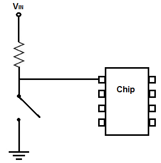
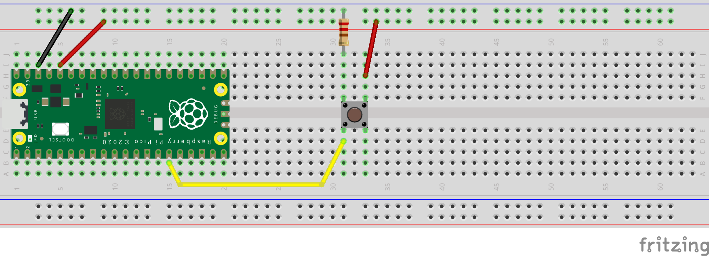

## button example
**With a push-button we illustrate the basic use of a GPIO pin as INPUT**  
A 10KΩ resistor will by applied directly on the breadboard to emphasize the need for a pull-down resistor when applying on/off input signal to the GPIO  

Example of pull-up and pull-down resistor applied for use with a button:

| Pull-Down Resistor                   | Pull-Up Resistor                |
|--------------------------------------|---------------------------------|
|  | |

### Hookup guide:

