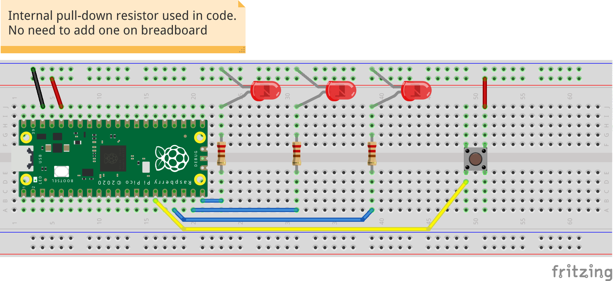

## button-led-chase example
**With a push-button INPUT signal we activate OUTPUT behavior** <br />
When the button is pressed, a for loop is implemented to sequence 3 LEDs turning on and off. <br />
<br />
_for_ loops are traditionally used when you have a block of code which you want to repeat a fixed number of times.<br />
__Example:__

```python
for x in range(5)
```

Here _x_ is a variable created specific to the _for_ loop in question.<br />
By default the value _x_ will begin as 0 and count +1 each time we run through the loop.<br />
We will exit the _for_ loop when _x_ has reached the number specified in the _range()_ function.

### Hookup guide:



