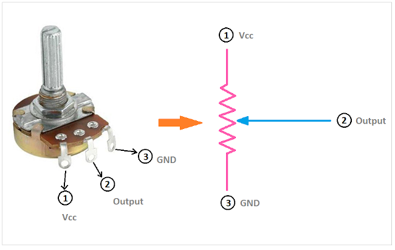
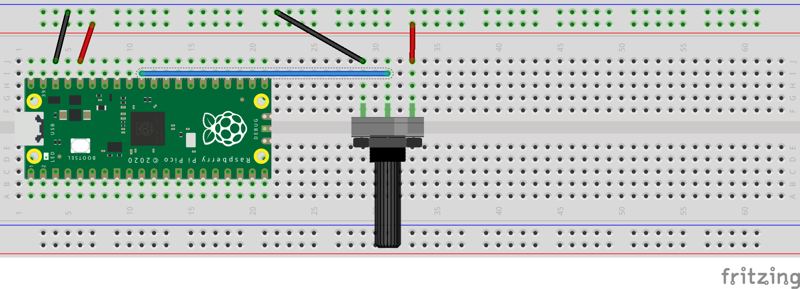

## adc example
Using a potentiometer we will introduce the use of analog sensors  

Two codes are included.  

_adc.py_ is for printing us the 16-bit value resulting from the potentiometer.  

_adc-fade-led.py_ is included as an example of applying the raw data to affect the intensity of a LED.  

 

__ADC is short for *Analog to Digital Coversion*__

A potentiometer is an analog device, more precisely it is a variable resistor.   
As with other analog sensors, we may introduce a potentiometer to a microcontroller to obtain a range of values exceeding only 1 or 0.
 

Connection schematic as follows:

### Hookup guide:

