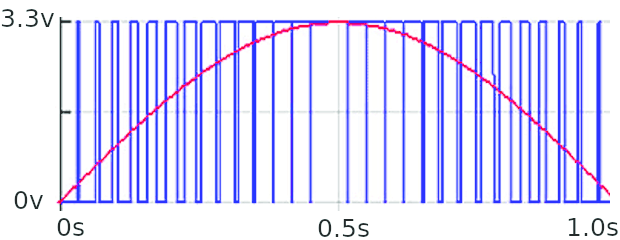

## pwm-fade example
**Using a single LED we will fade the luminosity on and off in a loop** <br />
We are here introducing a new function from the _machine_ module.<br />
<br />
PWM is short for __Pulse-Width Modulation__ <br />
Where one may believe that we are changing the luminosity of an LED, the reality is that we are blinking it so fast that it deceives our eyes. <br />
<br />
The diagram below roughly illustrates this behavior. Where the red line is what we think we see, the blue line illustrates what is actually happening:



<br />
In the example code you will notice two functions specific to using PWM. <br />
To control frequency of the pulse we use the following:

```python
pwm.freq(1000) #pulse one-thousand times per second
```

<br />
The _duty_ function refers to the on time between pulses. On a Raspberry Pico, the range is 0 to 65025.<br />
Examples as follows:

```python
pwm.duty_u16(0)     # entirely off
pwm.duty_u16(65025) # entirely on
pwm.duty_u16(32512) # on half the time
```

### Hookup guide:


